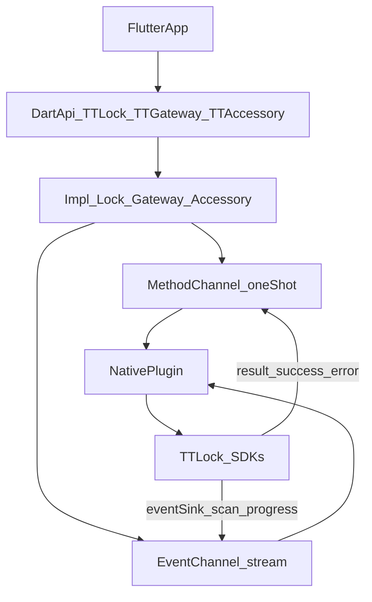

## 目标与原则

- **协议清晰**：
  - **一次性请求**（绝大多数 Future）：通过 **MethodChannel `result(...)` 直接返回**，由平台层保证“一次调用 ↔ 一次 result”的对应。
  - **长流事件**（扫描/进度/广播）：仅通过 **EventChannel** 推送。
- **结构调整**：原生与 Dart 侧按域拆分、削减巨型分发与重复样板，提升可维护性与可测试性。
- **兼容策略**：内部重构不破坏现有对外 API；legacy facade 保留一段时间后按版本节点下线。**暂不引入 requestId**。

## 现状关键发现（用于指导重构）

- **Dart 通道**：[`lib/src/platform/tt_lock_method_channel.dart`] 当前所有结果都通过 EventChannel 回传，用 completer + command 关联；一次性请求改为 MethodChannel 直接返回后，该路径可简化。
- **Dart 业务实现**：[`lib/src/impl/tt_lock_impl.dart`]（~~900+ 行）、[`lib/src/impl/tt_accessory_impl.dart`]（~~450+ 行）存在大量重复“拼参数/解析 map”，需抽取样板。
- **iOS**：[`ios/Classes/TtlockFlutterPlugin.m`] 超长 `if/else` 分发，几乎所有结果都走 EventChannel，MethodChannel `result` 基本未用；需改为 one-shot 走 `result()`，仅 scan/progress 走 eventSink。
- **Android**：[`android/.../TtlockFlutterPlugin.java`] 插件入口/分发/队列/超时/权限/事件推送集中单类，`doNextCommandAction()` 超大 switch；需改为 one-shot 走 `result.success()`，仅长流走 EventChannel，并做模块拆分。
- **legacy**：[`lib/ttlock_classic.dart`]（~1500+ 行）及多个 `lib/tt*.dart` 为兼容层，可后续收敛与下线。

## 分阶段重构路线

### Phase 0：建立契约与回归基线（不改行为）

- 产出“命令清单 / 参数 / 回包字段”的契约文档（可复用 `lib/src/constants/commands.dart` 与原生常量）。
- 明确哪些命令为 **one-shot**（走 MethodChannel result）、哪些为 **stream/progress**（走 EventChannel）。
- 为关键路径准备最小回归用例（一次性请求成功/失败、扫描流、进度流）。

### Phase 1：MethodChannel / EventChannel 使用改造（拆为 4 步，每步可验证）

**总体约定**

- **一次性请求**：Native 调用 `result.success(data)` 或 `result.error(...)`，Dart 侧通过 `await invokeMethod(...)` 得到该次结果。
- **长流**（扫描、进度）：仅通过 EventChannel 推送，事件结构保持 `{ command, resultState, data, errorCode?, errorMessage? }`。
- 采用**白名单 + 双轨**：先让部分命令走 MethodChannel，其余仍走 EventChannel，每步完成后均可跑通再进入下一步。

---

**Phase 1.1：Dart 平台层双轨（不改变当前行为）**

- 在 [`lib/src/platform/tt_lock_method_channel.dart`] 中引入 **one-shot 命令白名单**（常量集合，如 `TTCommands.oneShotCommands`）。
- `invoke()` 逻辑：若 `command` 在白名单内，则 `return await _commandChannel.invokeMethod(command, params)`（并做好异常转 Dart Exception）；否则保持现有 completer + EventChannel 等待逻辑。
- **白名单初始为空**（或仅放一个仅用于自测的占位命令），这样当前所有命令仍走原路径，行为不变。
- 验收：跑现有用例，确认无回归。

---

**Phase 1.2：iOS 首批 one-shot 改为 result() + Dart 白名单联动**

- 在 Phase 0 契约中选定 **首批 3–5 个门锁 one-shot 命令**（如 `getLockVersion`、`getBatteryLevel`、`getLockPower` 等），写入 Dart 与 iOS 共用白名单。
- **iOS** [`ios/Classes/TtlockFlutterPlugin.m`]：仅对这 3–5 个命令，在 SDK 回调里调用 `result(...)` 返回，**不再**对这些命令调用 `callbackCommand` 推 eventSink。
- **Dart**：将上述命令加入白名单，使它们走 `invokeMethod` 路径。
- 验收：在 iOS 上对这 3–5 个命令分别调用，确认 Dart 能拿到结果且无重复回调；扫描/进度仍走 EventChannel 不变。

---

**Phase 1.3：Android 首批 one-shot 改为 result + 联调**

- 对**同一批**白名单命令，在 **Android** [`TtlockFlutterPlugin.java`] 中改为在回调里调用 `result.success(...)` 或 `result.error(...)`，**不再**对这些命令调用 `callbackCommand`。
- 门锁队列中的命令需**携带当次 MethodCall 的 Result**（如 `CommandObj` 增加 `Result result` 字段），在 `apiSuccess`/`apiFail` 时调用该 `result` 而非统一走 `callbackCommand`。
- 验收：在 Android 上对同一批命令调用，确认行为与 iOS 一致；扫描/进度仍正常。

---

**Phase 1.4：全量 one-shot 切 MethodChannel，Dart 收尾**

- 将**所有** one-shot 命令（由 Phase 0 契约列出）加入白名单，并在 **iOS / Android** 上对每个 one-shot 分支改为 `result()` 返回，不再向 EventChannel 推送这些命令的 success/error。
- **Dart**：删除“非白名单时用 completer + EventChannel 等待”的分支，改为**仅保留**：白名单内用 `invokeMethod`，白名单外视为非法或仅剩 scan/progress（由 `eventStream()` 使用）。若当前设计是“所有 invoke 都在白名单”，则 `invoke()` 仅保留 `invokeMethod` 一条路径；`eventStream()` 仍只用于扫描/进度。
- 验收：全量回归；扫描与进度类 API 仍只通过 EventChannel 工作。

---

### Phase 2：原生侧结构调整（拆为 4 步，每步可验证）

**Phase 2.1：iOS 用“路由表”替代超长 if/else（同一文件内）**

- 在 [`ios/Classes/TtlockFlutterPlugin.m`] 内，将现有 `if ([command isEqualToString:...])` 链改为一个 **NSDictionary 或 block 表**：`command -> block(lockModel, result)`，在 `handleMethodCall` 里根据 `call.method` 查表执行。
- 不新增文件、不改变每个分支内部逻辑，只改变“如何分发”。
- 验收：现有命令行为不变，便于后续按域拆分。

---

**Phase 2.2：iOS 按域拆成独立 Handler 文件**

- 将路由表中的 block 按域替换为对 **LockHandler / GatewayHandler / RemoteHandler / KeypadHandler / DoorSensorHandler / MeterHandler** 等类的调用，每个 handler 一个文件，负责该域内命令的参数解析与 SDK 调用。
- 主类 `TtlockFlutterPlugin` 只保留：通道注册、`handleMethodCall` 查表转发、`callbackCommand` 与 eventSink 封装。
- 验收：行为不变，主文件行数明显减少，新命令只需改对应 handler。

---

**Phase 2.3：Android 抽出 CommandRouter（分发层，逻辑暂不动）**

- 在 [`TtlockFlutterPlugin.java`] 中抽出 **CommandRouter**（或等价类）：`onMethodCall` 只做“按域选 handler”（gateway / remote / keypad / doorLock / …），具体门锁命令仍由现有 `doorLockCommand` + `doNextCommandAction` 的 switch 执行。
- 不改变门锁队列、超时、apiSuccess/apiFail 等逻辑，只增加一层“按域路由”。
- 验收：行为不变，为下一步拆 scheduler/handler 打基础。

---

**Phase 2.4：Android 拆 CommandScheduler + 各域 Handler + 生命周期**

- **CommandScheduler**：专门负责门锁命令队列、超时、重试、`apiSuccess`/`apiFail` 时回调 `Result`。
- 各域 **Handler**：从 `TtlockFlutterPlugin` 中迁出 gateway/remote/keypad/doorSensor/meter 等具体实现，每域一个类；门锁域可保留为 `DoorLockHandler`，内部仍可暂时用 switch，后续再细拆。
- **PermissionGate**：统一蓝牙/位置权限请求与“授权后恢复扫描”的逻辑。
- 在 `onDetachedFromEngine` / `onDetachedFromActivity` 中统一清理：停止扫描、清空队列、移除 Handler 回调和 eventSink。
- 验收：行为不变，主类瘦身，生命周期无泄漏。

### Phase 3：Dart 层收敛与可测试性

- 拆分 `TTCommands`：按域拆文件（lock/gateway/accessory/meter），stream/progress/error 分类按域维护。
- impl 层抽取通用 `_invoke<T>(cmd, params, parser)`、`_stream<T>(...)`，统一 map 解析与容错。
- 保持 `TTLockPlatform` 抽象，便于单测 mock。

### Phase 4：legacy facade 收敛与下线（可选）

- 将 legacy 错误映射、回调桥接、scan 订阅管理集中到统一 adapter，减少 `ttlock_classic.dart` 重复。
- 按版本节点：Deprecated 声明 → 迁移指南 → 移除或拆为独立包。

## 风险与回滚策略

- **分步验证**：Phase 1.1 / 1.2 / 1.3 / 1.4 与 Phase 2.1–2.4 每步完成后都跑一遍回归再进入下一步；任一步有问题可停在当前步回滚该步改动。
- **协议回滚**：Phase 1.1–1.3 期间 Dart 白名单可随时缩小或置空，使对应命令回退到 EventChannel 路径；Phase 1.4 完成后若需整体回退，可恢复“所有命令走 EventChannel”的旧实现并回退 Native 的 result 改动。

## 重点文件清单（本计划主要触达）

- Dart：
  - [`/Users/chuyi/StudioProjects/ttlock_flutter_onpremise/lib/src/platform/tt_lock_method_channel.dart`]
  - [`/Users/chuyi/StudioProjects/ttlock_flutter_onpremise/lib/src/platform/tt_lock_platform.dart`]
  - [`/Users/chuyi/StudioProjects/ttlock_flutter_onpremise/lib/src/impl/tt_lock_impl.dart`]
  - [`/Users/chuyi/StudioProjects/ttlock_flutter_onpremise/lib/src/impl/tt_accessory_impl.dart`]
  - [`/Users/chuyi/StudioProjects/ttlock_flutter_onpremise/lib/src/constants/commands.dart`]
  - legacy：[`/Users/chuyi/StudioProjects/ttlock_flutter_onpremise/lib/ttlock_classic.dart`]
- iOS：
  - [`/Users/chuyi/StudioProjects/ttlock_flutter_onpremise/ios/Classes/TtlockFlutterPlugin.m`]
  - [`/Users/chuyi/StudioProjects/ttlock_flutter_onpremise/ios/Classes/TtlockModel.h`], [`/Users/chuyi/StudioProjects/ttlock_flutter_onpremise/ios/Classes/TtlockModel.m`]
  - [`/Users/chuyi/StudioProjects/ttlock_flutter_onpremise/ios/Classes/TtlockPluginConfig.h`]
- Android：
  - [`/Users/chuyi/StudioProjects/ttlock_flutter_onpremise/android/src/main/java/com/ttlock/ttlock_flutter/TtlockFlutterPlugin.java`]
  - `android/.../constant/*Command.java`, `android/.../constant/TTParam.java`
  - `android/.../model/*ErrorConverter.java`

## 架构目标图（Hybrid 通道分工）

