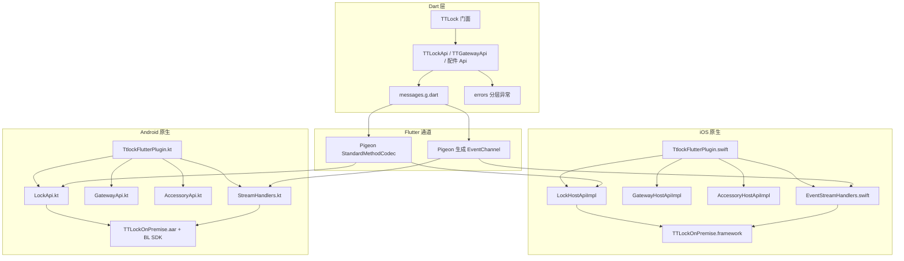

# TTLock Flutter On-Premise 插件架构设计

本文描述 `ttlock_flutter_onpremise`（以下简称 **On-Premise 新框架**）的分层结构，并与 `ttlock_flutter_premise`（**Premise 老框架**）做对比，便于理解与迁移。

---

## 1. 概述

On-Premise 新框架是一个 **Flutter Plugin**，面向私有化 / 本地部署场景，在 Dart 侧通过 **Pigeon** 与原生通信，将「命令式 MethodChannel + 全局 EventChannel」重构为 **类型化的 Host API + 多路事件流**，并统一错误模型与模块边界。

| 项目 | 说明 |
|------|------|
| 包名（pubspec `name`） | `ttlock_premise_flutter`（与历史包名一致，便于替换依赖） |
| 支持平台 | Android、iOS；Pigeon 配置中含 HarmonyOS（ArkTS）代码生成路径，是否接入以工程为准 |
| 原生 SDK | iOS：`TTLockOnPremise`（CocoaPods）；Android：`libs/TTLockOnPremise.aar`，Dart 侧锁能力在 Android 上通过 `com.ttlock.bl.sdk` 等回调对接 |

---

## 2. 整体分层

**数据流要点：**

- **一次性调用**：Dart `TT*HostApi` → Pigeon → 原生 `*HostApi` 实现 → 厂商 SDK → `Result` / `FlutterError` 回传。
- **持续事件**：Dart 订阅 Pigeon 生成的 `Stream` → 对应原生 `*StreamHandler`（iOS / Android 各一份实现）→ SDK 扫描/添加流程回调 → `success` / `error` 推送到 Flutter。

---

## 3. Dart 层架构

### 3.1 目录与职责

| 路径 | 职责 |
|------|------|
| `lib/ttlock.dart` | 对外主入口：`TTLock` 单例，暴露 `lock`、`gateway`、`remoteKey`、`remoteKeypad`、`doorSensor`、`waterMeter`、`electricMeter`；`configurePigeon` / `setImplementations` 用于测试。 |
| `lib/src/tt_*_api.dart` | 各领域 Facade：`TTLockApi`、`TTGatewayApi` 等，封装 Pigeon Host 调用，将 `PlatformException` 转为 `lib/errors` 下具体异常。 |
| `lib/pigeon/messages.g.dart` | Pigeon 生成代码（勿手改）；含数据类、枚举、`TTLockHostApi` 等。 |
| `pigeons/messages.dart` | Pigeon **唯一信源**：`@HostApi`、数据模型、`@ConfigurePigeon` 输出路径（Dart / Kotlin / Swift / ArkTS）。 |
| `lib/errors/` | 类型化异常：`TTLockException`、`TTGatewayException` 等，与业务域对齐。 |
| `lib/src/pigeon_errors.dart` | 将 Pigeon/平台错误映射为上述异常的内部工具。 |
| 兼容导出 | `ttlock_classic.dart`、`ttgateway.dart` 等文件保留旧文件名导出，降低上层迁移成本。 |

### 3.2 API 形态

- **Future 风格**：初始化锁、改密、网关连接等，对应 `TTLockHostApi` / `TTGatewayHostApi` / `TTAccessoryHostApi` 中带 `@async` 的方法。
- **Stream 风格**：扫描锁、扫 WiFi、加卡/指纹/人脸、网关扫描、配件扫描等，对应 Pigeon 声明的 **EventChannel** 封装（如 `lockScanLock()`、`lockScanWifi()`）。
- **上下文注入**：部分流依赖原生侧上下文（如锁的 `lockData`、网关 MAC、键盘 MAC）。Dart 层在订阅前通过 Host API 调用（如 `setEventLockData`）或已在 `TTLockApi` 的 Stream 方法内组合 `setEventLockData` + `asyncExpand`，避免调用顺序错误。

### 3.3 构建与代码生成

- 修改 `pigeons/messages.dart` 后执行：`fvm dart run pigeon --input pigeons/messages.dart`（或项目约定的 `dart run`）。
- 生成物：`lib/pigeon/messages.g.dart`、`android/.../Messages.kt`、`ios/Classes/Messages.swift` 等。

---

## 4. 原生层架构

### 4.1 iOS（Swift）

| 文件 | 职责 |
|------|------|
| `TtlockFlutterPlugin.swift` | 注册 Pigeon：`TTLockHostApiSetup` / `TTGatewayHostApiSetup` / `TTAccessoryHostApiSetup`；注册各 `*StreamHandler`；启动时 `TTLock.setupBluetooth`。 |
| `LockHostApiImpl.swift` / `GatewayHostApiImpl.swift` / `AccessoryHostApiImpl.swift` | 实现 Pigeon 协议，将参数转为 `TTLockOnPremise` 字典或 API 调用；异步结果用 completion 回传。 |
| `EventStreamHandlers.swift` | 各扫描/添加类流的 `onListen` / `onCancel`，与 `EventContextStore` 共享的 `lockData`、网关 MAC 等协作。 |
| `EnumConverter.swift` / `TtlockPremiseSupport.swift` | 枚举、模型与 Pigeon 类型互转。 |
| `Messages.swift` | Pigeon 生成。 |

**特点**：插件入口极薄；**命令与事件分离**（Host API vs StreamHandler），单文件职责清晰，较老框架 Obj-C 单类上千行更易维护。

### 4.2 Android（Kotlin）

| 文件 | 职责 |
|------|------|
| `TtlockFlutterPlugin.kt` | `FlutterPlugin`：保存 `Context` / `BinaryMessenger`，`prepareBTService` 初始化各 Client，组装 `ScanLockImpl`、`*Api` 等。 |
| `LockApi.kt` / `GatewayApi.kt` / `AccessoryApi.kt` | 实现 Pigeon `TTLockHostApi` 等，内部调用 `TTLockClient`、`GatewayClient`、`RemoteClient`、键盘/门磁/表计等 **BL SDK** API。 |
| `StreamHandlers.kt` | 与 iOS 对等的各 `PigeonEventSink` 实现（扫描、加卡、网关 WiFi 等）。 |
| `LockStreamParams.kt` | 与锁相关的流参数（如 `rememberLockData`），与 iOS `EventContextStore` 概念一致。 |
| `Messages.kt` | Pigeon 生成。 |

**特点**：从老框架 **单文件 Java 插件**（MethodChannel 分发）拆为 **多类 Kotlin**；Android 侧更依赖 `com.ttlock.bl.sdk` 回调模型，与 iOS 共用同一套 Pigeon 契约。

---

## 5. 与 `ttlock_flutter_premise`（老框架）的差异

### 5.1 对比总表

| 维度 | On-Premise 新框架 | Premise 老框架 |
|------|-------------------|----------------|
| **Dart ↔ 原生协议** | Pigeon：强类型方法 + 自动 EventChannel | 固定 `MethodChannel("com.ttlock/command/ttlock")` + 单一 `EventChannel("com.ttlock/listen/ttlock")` |
| **调用方式** | 方法名即 API（生成代码），参数为 Dart 类/枚举 | 字符串 command 常量 + `Map`/JSON 手工序列化 |
| **事件订阅** | 每个场景独立 Stream（类型明确） | 全局一个 EventSink，靠 payload 内字段区分事件类型 |
| **错误处理** | `FlutterError` → `TTLockException` 等域异常 | `callback_success` / `callback_fail` 等字符串状态 + 解析 |
| **Dart 入口** | `TTLock.lock` / `.gateway` / 配件… 分域 | `TTLock` 巨型静态类 + `ttgateway.dart`、`ttremotekey.dart` 等并列文件 |
| **iOS 实现语言** | Swift，多文件拆分 | Objective-C（`TtlockFlutterPlugin.m` 集中处理） |
| **Android 实现语言** | Kotlin，多模块类 | Java（`TtlockFlutterPlugin.java` 超大类） |
| **依赖 SDK** | 同为 `TTLockOnPremise`（iOS Pod / Android aar） | 相同 |
| **Dart SDK 约束** | `>=3.0.0 <4.0.0` | `>=2.18.0 <4.0.0`（老仓库 pubspec） |
| **Pigeon / OHOS** | dev 依赖 Pigeon，配置含 ArkTS 输出 | 老仓库无 Pigeon；部分分支 pubspec 曾声明 `ohos` 平台（以实际仓库为准） |

### 5.2 设计层面的利弊（简评）

**新框架优势：**

- 编译期检查方法名与参数类型，减少字符串拼写错误。
- 流与命令分离，避免单 EventChannel 上多业务互相干扰、难以背压/取消的问题（仍依赖调用方正确 `cancel` 订阅）。
- 原生侧可测试性更好：Host API 与 StreamHandler 可拆分 mock。

**迁移时注意：**

- 老代码中大量 `invokeMethod(command, args)` 需改为对应 `TTLockApi` / `TTGatewayApi` 等方法或 `Stream`。
- 老框架「全局监听」模式需改为「按业务订阅对应 Stream」，并保证 `setEventLockData` / `setEventGatewayMac` 等在订阅前就绪（新框架 Dart 层已对部分流做封装）。

---

## 6. 文档维护

- 接口变更应优先改 `pigeons/messages.dart` 并重新运行 Pigeon。
- 若新增扫描类能力，需同时实现 iOS `EventStreamHandlers.swift` 与 Android `StreamHandlers.kt`，并在 `TtlockFlutterPlugin` 两侧注册。

---

*生成说明：本文基于仓库内源码结构整理；HarmonyOS 是否启用以宿主工程与生成物是否纳入构建为准。*
